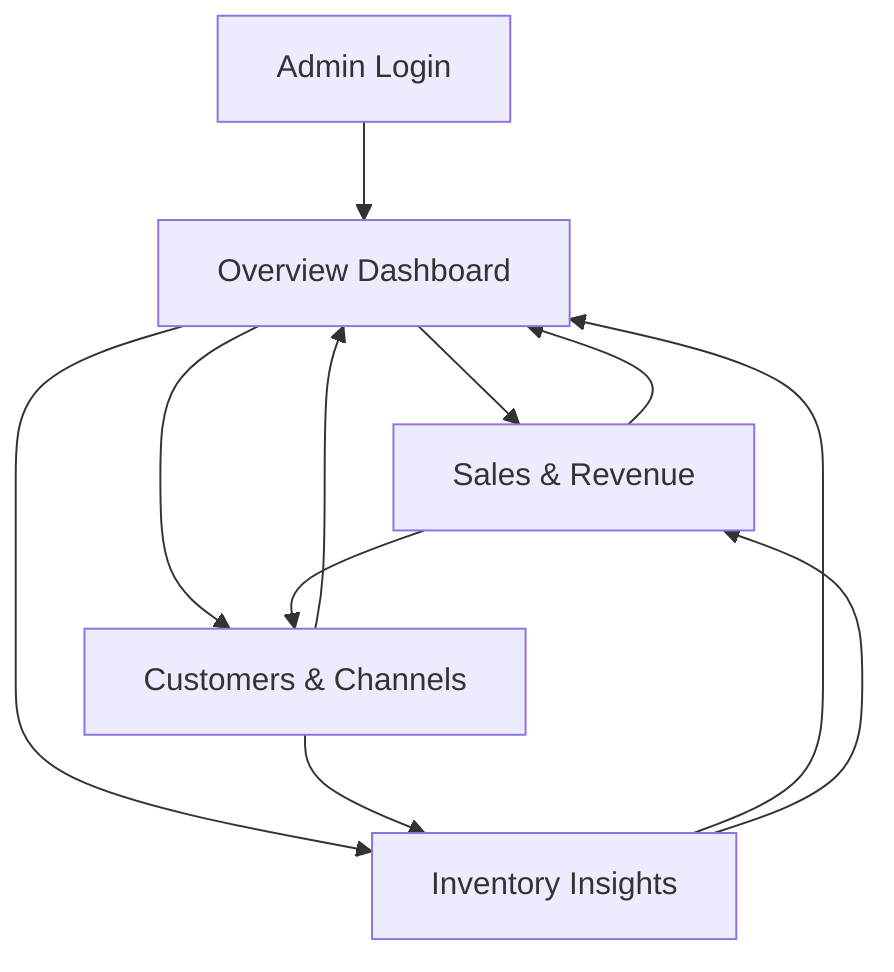

# Design Document

## Overview

This design document outlines the architecture and implementation approach for reorganizing the admin dashboard into a multi-page structure. The redesign transforms the current single-page dashboard into a modular system with four main sections: Overview Dashboard, Sales & Revenue, Customers & Channels, and Inventory Insights. This approach improves usability, reduces cognitive load, and provides better organization of analytics data.

The design maintains the existing AnalyticsService and data models while restructuring the presentation layer to create dedicated pages for different analytics domains. The solution leverages Laravel's routing, Blade components, and the existing analytics infrastructure.

## Architecture

### High-Level Structure

```
Admin Dashboard System
├── Overview Dashboard (Landing Page)
│   ├── Summary Cards (Revenue, Orders, Customers, Inventory)
│   ├── User Statistics
│   ├── System Health
│   └── Quick Actions
├── Sales & Revenue Page
│   ├── Revenue Metrics
│   ├── Order Statistics
│   ├── Sales Trend Chart
│   ├── Top Products Table
│   └── Category/Brand Breakdown
├── Customers & Channels Page
│   ├── Customer Metrics
│   ├── Channel Comparison (Walk-in vs Online)
│   ├── Payment Method Distribution
│   └── Customer Acquisition Trends
└── Inventory Insights Page
    ├── Low Stock Alerts
    ├── Inventory Movements
    ├── Revenue by Location
    └── Stock Level Trends
```

### Navigation Flow



### Component Architecture

The system uses a shared component architecture where:
- **Shared Components**: Analytics cards, charts, tables are reusable across pages
- **Layout Component**: Admin layout provides consistent header, navigation, and time period filter
- **Controller Layer**: Separate controller methods for each page, sharing the AnalyticsService
- **Service Layer**: Existing AnalyticsService provides data to all pages

## Components and Interfaces

### 1. Controllers

#### AdminDashboardController (Enhanced)

```php
class DashboardController extends Controller
{
    // Existing: index() - Now returns overview dashboard
    public function index(Request $request): View
    
    // New: Sales & Revenue page
    public function salesRevenue(Request $request): View
    
    // New: Customers & Channels page
    public function customersChannels(Request $request): View
    
    // New: Inventory Insights page
    public function inventoryInsights(Request $request): View
    
    // Existing: Export and AJAX methods remain unchanged
    public function exportAnalytics(Request $request): StreamedResponse
    public function getAnalyticsData(Request $request): JsonResponse
}
```

### 2. Routes

```php
// Admin Dashboard Routes
Route::prefix('admin')->middleware(['auth', 'admin'])->group(function () {
    Route::get('/dashboard', [DashboardController::class, 'index'])->name('admin.dashboard');
    Route::get('/dashboard/sales-revenue', [DashboardController::class, 'salesRevenue'])->name('admin.dashboard.sales');
    Route::get('/dashboard/customers-channels', [DashboardController::class, 'customersChannels'])->name('admin.dashboard.customers');
    Route::get('/dashboard/inventory-insights', [DashboardController::class, 'inventoryInsights'])->name('admin.dashboard.inventory');
    Route::get('/analytics/export', [DashboardController::class, 'exportAnalytics'])->name('admin.analytics.export');
    Route::get('/analytics/data', [DashboardController::class, 'getAnalyticsData'])->name('admin.analytics.data');
});
```

### 3. Views Structure

```
resources/views/admin/
├── dashboard.blade.php (Overview)
├── sales-revenue.blade.php (New)
├── customers-channels.blade.php (New)
└── inventory-insights.blade.php (New)

resources/views/components/
├── analytics-card.blade.php (Existing, reused)
├── sales-chart.blade.php (Existing, reused)
├── top-products-table.blade.php (Existing, reused)
├── category-breakdown.blade.php (Existing, reused)
├── payment-methods-chart.blade.php (Existing, reused)
└── dashboard-navigation.blade.php (New)
```

### 4. Blade Components

#### Dashboard Navigation Component

```php
// resources/views/components/dashboard-navigation.blade.php
@props(['current' => 'overview'])

<nav class="bg-white shadow-sm mb-6 rounded-lg">
    <div class="flex space-x-4 p-4">
        <a href="{{ route('admin.dashboard') }}" 
           class="nav-link {{ $current === 'overview' ? 'active' : '' }}">
            Overview
        </a>
        <a href="{{ route('admin.dashboard.sales') }}" 
           class="nav-link {{ $current === 'sales' ? 'active' : '' }}">
            Sales & Revenue
        </a>
        <a href="{{ route('admin.dashboard.customers') }}" 
           class="nav-link {{ $current === 'customers' ? 'active' : '' }}">
            Customers & Channels
        </a>
        <a href="{{ route('admin.dashboard.inventory') }}" 
           class="nav-link {{ $current === 'inventory' ? 'active' : '' }}">
            Inventory Insights
        </a>
    </div>
</nav>
```

## Data Models

### Existing Models (No Changes Required)

- **User**: User accounts and roles
- **Order**: Order transactions
- **OrderItem**: Individual order line items
- **Product**: Product catalog
- **Inventory**: Stock levels by location
- **InventoryMovement**: Stock movement history
- **Payment**: Payment transactions
- **Category**: Product categories
- **Brand**: Product brands

### Data Flow

```
Request → Controller → AnalyticsService → Database Models → Cache → Response
                                                                      ↓
                                                                   View
```

The AnalyticsService acts as the data aggregation layer, querying models and caching results. Controllers pass this data to views for rendering.

## Correctness Properties

*A property is a characteristic or behavior that should hold true across all valid executions of a system-essentially, a formal statement about what the system should do. Properties serve as the bridge between human-readable specifications and machine-verifiable correctness guarantees.*


### Property Reflection

After reviewing the prework analysis, several properties can be consolidated:

- Properties 1.5, 2.5, and 6.2 all test that changing the time period updates metrics - these can be combined into one comprehensive property
- Properties 5.1 and 5.4 both test navigation consistency - these can be combined
- Properties 2.4, 3.2, 4.1, and 4.4 all test that data includes required fields - these follow the same pattern and can be generalized

The following properties provide unique validation value and will be implemented:

Property 1: Summary cards display current and previous period data
*For any* time period selection, all summary cards on the overview dashboard should display both current period values and percentage changes from the previous period
**Validates: Requirements 1.2**

Property 2: Clickable cards navigate to detailed pages
*For any* summary card on the overview dashboard, the card should contain a valid route link to its corresponding detailed analytics page
**Validates: Requirements 1.3**

Property 3: Time period filter updates all metrics
*For any* dashboard page and any time period selection, changing the period filter should update all displayed metrics, charts, and tables to reflect the new period
**Validates: Requirements 1.5, 2.5, 6.2**

Property 4: Sales trend chart adapts to period
*For any* time period selection on the Sales & Revenue page, the sales trend chart should display data points that match the granularity and range of the selected period
**Validates: Requirements 2.3**

Property 5: Product data completeness
*For any* product displayed in top-selling products, the product data should include product name, quantity sold, and revenue generated
**Validates: Requirements 2.4**

Property 6: CSV export includes period data
*For any* time period selection, the exported CSV file should contain only data from the selected period and include all relevant metrics
**Validates: Requirements 2.6**

Property 7: Channel data completeness
*For any* sales channel (walk-in or online), the channel data should include revenue amount and order count
**Validates: Requirements 3.2**

Property 8: Channel percentage distribution sums to 100
*For any* channel comparison display, the sum of walk-in percentage and online percentage should equal 100%
**Validates: Requirements 3.3**

Property 9: Payment method data includes percentages
*For any* payment method in the distribution chart, the payment method data should include a percentage value
**Validates: Requirements 3.4**

Property 10: Inventory alert data completeness
*For any* low stock alert displayed, the alert should include product name, current quantity, and reorder level
**Validates: Requirements 4.1**

Property 11: Inventory alerts have severity classification
*For any* inventory alert displayed, the alert should be categorized as critical, warning, or normal based on stock levels
**Validates: Requirements 4.2**

Property 12: Inventory movements include transaction references
*For any* inventory movement displayed, the movement should include a transaction reference when applicable
**Validates: Requirements 4.4**

Property 13: Location filter affects inventory alerts
*For any* location selection, the displayed inventory alerts should only include items from the selected location
**Validates: Requirements 4.5**

Property 14: Navigation menu present on all pages
*For any* dashboard page (overview, sales, customers, inventory), the page should display a navigation menu with links to all four dashboard sections
**Validates: Requirements 5.1, 5.4**

Property 15: Active page highlighted in navigation
*For any* dashboard page, the navigation menu should highlight the menu item corresponding to the current page
**Validates: Requirements 5.2**

Property 16: Period persists across navigation
*For any* time period selection and any navigation between dashboard pages, the selected period should be maintained in the URL and applied to the new page
**Validates: Requirements 5.3, 6.1**

Property 17: Date range validation
*For any* custom date range selection, if the end date is before the start date, the system should reject the selection and display a validation error
**Validates: Requirements 6.3**

Property 18: Export respects current period
*For any* time period selection, the exported CSV data should only include records that fall within the selected period's date range
**Validates: Requirements 6.4**

## Error Handling

### Validation Errors

1. **Invalid Date Range**: When a custom date range has an end date before the start date
   - Display validation error message
   - Prevent form submission
   - Maintain previous valid period selection

2. **Invalid Period Parameter**: When URL contains an invalid period value
   - Default to 'month' period
   - Log warning for debugging
   - Continue with default period

3. **Missing Required Parameters**: When custom period is selected without dates
   - Display validation error
   - Require both start_date and end_date
   - Prevent form submission

### Data Errors

1. **Analytics Service Failure**: When AnalyticsService throws an exception
   - Log error with full stack trace
   - Display user-friendly error message
   - Show cached data if available
   - Allow page to render with partial data

2. **Database Connection Failure**: When database is unavailable
   - Display system health warning
   - Show cached analytics if available
   - Provide retry mechanism

3. **Empty Data Sets**: When no data exists for selected period
   - Display "No data available" message
   - Show zero values in metrics
   - Render empty charts with appropriate messaging

### Navigation Errors

1. **Unauthorized Access**: When non-admin user attempts to access dashboard
   - Redirect to appropriate dashboard based on role
   - Log unauthorized access attempt
   - Display access denied message if needed

2. **Invalid Route**: When accessing non-existent dashboard page
   - Return 404 error
   - Provide link back to overview dashboard
   - Log invalid route access

## Testing Strategy

### Unit Testing

Unit tests will verify individual components and methods:

1. **Controller Method Tests**
   - Test each controller method returns correct view
   - Test data is passed correctly to views
   - Test validation rules are applied
   - Test error handling paths

2. **Component Tests**
   - Test analytics card component renders correctly
   - Test navigation component highlights active page
   - Test chart components receive correct data format

3. **Helper Method Tests**
   - Test date range calculation methods
   - Test period persistence logic
   - Test URL parameter handling

### Property-Based Testing

Property-based tests will verify universal properties using **Pest PHP** with the **pest-plugin-faker** for data generation. Each property test will run a minimum of 100 iterations.

1. **Data Completeness Properties**
   - Generate random products and verify all required fields present
   - Generate random alerts and verify severity classification
   - Generate random channels and verify percentage calculations

2. **Filter Behavior Properties**
   - Generate random periods and verify metrics update correctly
   - Generate random locations and verify filtering works
   - Generate random date ranges and verify validation

3. **Navigation Properties**
   - Test period persistence across all page combinations
   - Test navigation menu presence on all pages
   - Test active page highlighting for all pages

4. **Export Properties**
   - Generate random periods and verify CSV contains correct data
   - Verify CSV includes all required metrics
   - Verify CSV data matches displayed data

### Integration Testing

Integration tests will verify end-to-end workflows:

1. **Dashboard Navigation Flow**
   - Navigate from overview to each detailed page
   - Verify data loads correctly on each page
   - Verify period filter persists

2. **Period Filter Integration**
   - Change period on overview, navigate to sales page
   - Verify sales page shows data for selected period
   - Repeat for all page combinations

3. **Export Integration**
   - Select period, export from each page
   - Verify CSV contains correct period data
   - Verify CSV format is valid

### Browser Testing

Browser tests will verify UI behavior:

1. **Responsive Design**
   - Test layout on mobile, tablet, desktop sizes
   - Verify navigation collapses on mobile
   - Verify charts scale appropriately

2. **Interactive Elements**
   - Test period filter dropdown
   - Test navigation links
   - Test export button
   - Test card click navigation

## Implementation Notes

### Phase 1: Controller and Routes
- Add new controller methods for each page
- Create new routes for dashboard sections
- Implement period persistence logic

### Phase 2: Views and Components
- Create new Blade views for each page
- Extract reusable components
- Implement navigation component
- Refactor overview dashboard

### Phase 3: Styling and Polish
- Apply consistent styling across pages
- Implement responsive design
- Add transitions and animations
- Test cross-browser compatibility

### Phase 4: Testing
- Write unit tests for controllers
- Implement property-based tests
- Create integration tests
- Perform browser testing

### Caching Strategy

The existing AnalyticsService caching will be maintained:
- Past period data cached for 24 hours
- Current period data cached for 15 minutes
- Cache keys include period and date for granular invalidation

### Performance Considerations

1. **Lazy Loading**: Load only data needed for current page
2. **Pagination**: Implement pagination for large data sets (top products, alerts)
3. **AJAX Updates**: Consider AJAX for period filter to avoid full page reload
4. **Database Indexing**: Ensure proper indexes on date and status columns

### Accessibility

1. **Keyboard Navigation**: Ensure all navigation works with keyboard
2. **Screen Readers**: Add ARIA labels to charts and cards
3. **Focus Indicators**: Maintain visible focus states
4. **Color Contrast**: Ensure text meets WCAG AA standards

### Browser Support

- Chrome (latest 2 versions)
- Firefox (latest 2 versions)
- Safari (latest 2 versions)
- Edge (latest 2 versions)
- Mobile browsers (iOS Safari, Chrome Mobile)
